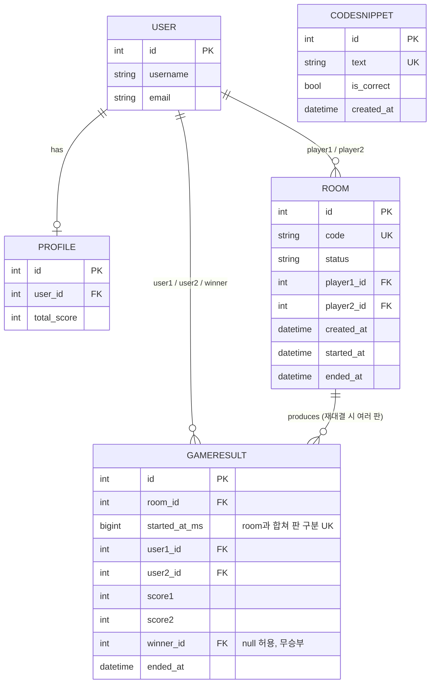

# 26s-w1-c2-06

## 공통과제 I : 웹 기반 프로젝트 (2인 1팀)

**목적:** 공통 과제를 함께 수행하며 웹 개발의 전체 흐름을 빠르게 익히고 협업에 적응하기

**결과물:** 기획부터 배포까지 완료된 웹 서비스와 관련 문서 일체

---

## 팀원

| 이름 | GitHub | 역할 |
|---|---|---|
| 박서윤 | [banunas](https://github.com/banunas) |  |
| 박도현 | [dotori235](https://github.com/dotori235) |  |

---

## 기획안

> 프로젝트 주제, 목적, 핵심 기능, 예상 사용자, 팀원별 역할 등 정리

- **주제:** 2인 실시간 대전 타이핑 게임 "코드비" — 화면에 낙하하는 코드 스니펫을 보고 빠르게 타이핑해 맞히는 웹 게임
- **목적:** 방(room)에 입장한 두 유저가 동일한 화면을 실시간으로 공유하며 경쟁하는 서비스를 통해, WebSocket 기반 실시간 동기화와 동시성 제어(레이스 컨디션 방지)를 직접 설계·구현해본다
- **핵심 기능:**
  - 화면에 코드 텍스트가 무작위로 스폰되어 위에서 아래로 낙하, 바닥에 닿으면 자동 소멸
  - 유저가 텍스트를 입력 후 Enter로 제출 → 낙하 중인 코드와 완전히 일치하면 판정 (정답 +500 / 오답 -500 / 불일치 0점)
  - 매칭된 코드는 두 유저 화면에서 동시에 즉시 제거되어 실시간 반영
  - Redis 원자 연산 기반으로 동시 제출 시에도 한 명만 점수를 획득하도록 레이스 컨디션 방지
- **예상 사용자:** 같은 방에서 실시간으로 함께 게임을 즐기고 싶은 2인 (친구, 스터디 메이트 등)

---

## 기능 명세서

> 구현할 기능을 사용자 관점에서 정리하고, 필수 기능과 선택 기능을 구분


전체 아키텍처 설계는 [docs/plan/architecture.md](./docs/plan/architecture.md) 참고

### 필수 기능

- [x] 회원가입/로그인 (아이디·비밀번호, 중복 아이디 검사)
- [x] 방 생성/참가 (초대 코드), 방 안 유저 목록 표시, "game start"로 시작
- [x] 낙하 코드 텍스트 실시간 스폰 (두 유저 화면에 동일하게 반영)
- [x] 텍스트 입력 후 Enter 제출 → 판정 매트릭스 (정답 +500 / 오답 -500 / 불일치 0점)
- [x] 매칭된 코드 즉시 제거, 양쪽 유저 화면에 실시간 반영
- [x] 한 판 60초 제한, 시간 종료 시 자동 결산
- [x] 게임 결과(이번 판 점수) DB 저장 + 유저 누적 점수 반영 (역대 최고 기록 기준, §DB 스키마 참고)
- [x] 결산 화면 (이번 판 점수 표시)

### 선택 기능

- [x] 승/패 판정 및 표시 (동점 처리 규칙 포함) — 설계 완료, [backend-implementation.md](./docs/plan/backend-implementation.md) §6 참고
- [x] 게임 중 이탈 시 즉시 종료 + 강제 패배 처리 — 설계 완료, [backend-implementation.md](./docs/plan/backend-implementation.md) §7 참고
- [x] 방장 위임/방 삭제 (방장 이탈 시) — 설계 완료, [backend-implementation.md](./docs/plan/backend-implementation.md) §7 참고
- [x] 재대결 — 방 유지, 방당 여러 판 저장. [backend-implementation.md](./docs/plan/backend-implementation.md) §6 참고
- [ ] 페이즈 시스템 (오전/오후/마감 직전 20초 단위로 스폰·낙하 속도 증가)
- [ ] 닉네임 표시 (계정 아이디와 별개로 인게임 표시명 사용 여부 — 미정)
- [ ] 타이핑 중 실시간 하이라이트 (해당 시 접두사 트라이 도입 필요, [architecture.md](./docs/plan/architecture.md) §9)

---

## IA 및 화면 설계서

> 서비스의 전체 페이지 구조와 페이지 간 이동 흐름; 각 페이지의 주요 UI 구성, 입력 요소, 버튼, 사용자 행동 흐름 등을 간단한 와이어프레임 형태로 정리

<!-- Figma 링크 또는 이미지 첨부 -->

---

## DB 스키마

> 필요한 테이블, 주요 필드, 데이터 타입, 테이블 간 관계를 정리

낙하 중인 코드, 선점 상태, 진행 중 점수처럼 계속 바뀌는 상태는 DB가 아니라 Redis가 담당하고([docs/plan/architecture.md](./docs/plan/architecture.md) §6), 아래는 **영속 데이터만** 담는 스키마 초안이다.



### 테이블 정의

| 테이블 | 필드 | 타입 | 설명 |
|---|---|---|---|
| **User** | (Django 기본 `auth.User`) | - | 로그인 계정 |
| **Profile** | user | OneToOne → User | |
| | total_score | int, default 0 | 지금까지 치른 판 중 가장 높았던 한 판의 점수 (역대 최고 기록, 누적 아님) |
| **Room** | code | string, unique | 초대/입장 코드 |
| | status | string (`waiting`/`playing`/`finished`) | 방 상태 |
| | player1, player2 | FK → User, null 허용 | 입장 순서대로 채워짐 |
| | created_at | datetime | 방 생성 시각 |
| | started_at | datetime, null 허용 | 두 유저가 다 들어와 게임이 시작된 시각 (Redis `game_started_at`과 동일 값을 영속화) |
| | ended_at | datetime, null 허용 | 60초 경과 후 종료 처리가 끝난 시각 |
| **GameResult** | room | FK → Room | 판(라운드)당 1행 — 재대결 시 방당 여러 행 가능 |
| | started_at_ms | bigint | 이 판의 `game_started_at` epoch ms. `(room, started_at_ms)`가 판을 구분하는 UK |
| | user1, user2 | FK → User | 이 매치에 참여한 두 유저 |
| | score1, score2 | int | 각 유저의 이번 한 판 최종 점수 (+500/-500 누적) |
| | winner | FK → User, null 허용 | 승자. null이면 무승부(정상 종료 시 동점) — 이탈 종료는 남은 유저로 강제 지정 |
| | ended_at | datetime, auto_now_add | 기록 생성 시각 |
| **CodeSnippet** | text | string, unique | 화면에 낙하시킬 코드 텍스트 (중복 등록 방지) |
| | is_correct | bool | 정답 코드 여부 |
| | created_at | datetime | |

### 관계 및 제약

- `Room.player1`/`player2`는 입장 시점에 채워지는 **누가 이 방에 있는지에 대한 유일한 영속 기록**이다. 게임 진행 중 실제 낙하/점수 상태는 Redis가 갖고 있고(architecture.md §6), Room 레코드는 재접속 시 "이 유저가 이 방에 들어올 자격이 있는가"를 DB로 검증하는 용도로 쓴다.
- `GameResult.room`은 **ForeignKey**다 — 재대결로 같은 방을 재사용하면 방당 여러 판이 쌓일 수 있어서, `(room, started_at_ms)` 조합을 유니크 제약(UK)으로 걸어 같은 판이 두 번 기록되지 않게 한다 ([docs/plan/backend-implementation.md](./docs/plan/backend-implementation.md) §6의 크래시 재시도 시나리오 대비). 유저별 1행이 아니라 판당 1행이라, 한 유저의 전체 전적을 조회하려면 `user1`/`user2` 양쪽을 다 확인해야 한다.
- `CodeSnippet`은 특정 Room에 종속되지 않는 **전역 풀**이다. 어떤 스니펫이 어느 방에서 스폰됐는지는 Redis(`used_snippet_ids:{room}`)에서만 휘발성으로 관리하고 DB엔 남기지 않는다.
- `Profile.total_score`는 `GameResult`가 새로 생성될 때만(재시도로 인한 중복 생성이 아닐 때만) 양쪽 유저 모두 `Greatest("total_score", score)`로 원자 갱신한다 — 누적합이 아니라 역대 최고 기록이라, 이번 판 점수가 기존 기록보다 낮으면 값이 바뀌지 않는다 ([docs/plan/backend-implementation.md](./docs/plan/backend-implementation.md) §6).

---

## API 문서

> API 주소, 요청 방식, 요청값, 응답값, 에러 상황을 정리

| Method | Endpoint | 설명 | 요청 | 응답 |
|---|---|---|---|---|
| GET | `/api/csrf/` | CSRF 쿠키 발급 (로그인/회원가입 전 최초 1회 호출) | - | `{"detail": "csrf cookie set"}` |
| POST | `/api/signup/` | 회원가입 | `{username, password}` | 201 `{id, username}` / 400 `{error: "username_password_required" \| "duplicate_username"}` |
| POST | `/api/login/` | 로그인 | `{username, password}` | 200 `{id, username}` / 401 `{error: "invalid_credentials"}` |
| POST | `/api/logout/` | 로그아웃 | - | `{"detail": "logged out"}` |
| GET | `/api/me/` | 로그인 상태 확인 | - | 200 `{id, username}` / 401 `{error: "not_authenticated"}` |
| POST | `/api/rooms/` | 방 생성 (호출자가 방장) | - | 201 `{code, status, player1, player2, is_host: true}` |
| GET | `/api/rooms/<code>/` | 방 정보 조회 | - | 200 `{code, status, player1, player2, is_host}` / 404 `{error: "room_not_found"}` |
| POST | `/api/rooms/<code>/join/` | 방 참가 | - | 200 `{..., is_host: false}` / 400 `{error: "room_full" \| "room_not_joinable"}` / 404 `{error: "room_not_found"}` |
| GET | `/api/leaderboard/` | 전체 랭킹 (0점 이하 제외 상위 5명 + 본인이 5위 밖이면 별도 표기) | - | 200 `{entries: [{rank, username, total_score}], me: {...} \| null}` |

WebSocket(`ws(s)://<host>/ws/room/<code>/`)으로 주고받는 실시간 이벤트(`game.start`/`code.spawn`/`code.result`/`game.over`/`rematch` 등)는 REST가 아니라 별도 프로토콜이라 이 표에는 없음 — 메시지 타입별 상세는 [architecture.md](./docs/plan/architecture.md), [backend-implementation.md](./docs/plan/backend-implementation.md) 참고.

---

## 배포 결과물

> 접속 가능한 링크, 실행 방법, 주요 구현 내용

- **서비스 URL:** https://codebee.madcamp-kaist.org
- **실행 방법:** 링크에 접속하기

```bash
# 실행 방법 작성

```
**노션링크:** https://furtive-selenium-dc5.notion.site/3913ca9f2d6d8042a363db66ebae946b?source=copy_link

---

## 회고 문서

> 개발 과정에서의 어려움, 해결 방법, 역할 분담, 다음에 개선할 점 (KPT 방법론 참고)

### Keep

### Problem

### Try

---

## 참고 자료

- [SDD(스펙 주도 개발) 이해하기](https://news.hada.io/topic?id=21338)
- [Software Design Document Best Practices](https://www.atlassian.com/work-management/project-management/design-document)
- [IA 정보구조도 작성 방법](https://brunch.co.kr/@nyonyo/7)
- [기획자 화면설계서 작성법](https://brunch.co.kr/@soup/10)
- [Figma 와이어프레임 가이드](https://www.figma.com/ko-kr/resource-library/what-is-wireframing/)
- [무료 Figma 와이어프레임 키트](https://www.figma.com/ko-kr/templates/wireframe-kits/)
- [ERD/DB 설계 총정리](https://inpa.tistory.com/entry/DB-%F0%9F%93%9A-%EB%8D%B0%EC%9D%B4%ED%84%B0-%EB%AA%A8%EB%8D%B8%EB%A7%81-%EA%B0%9C%EB%85%90-ERD-%EB%8B%A4%EC%9D%B4%EC%96%B4%EA%B7%B8%EB%9E%A8)
- [API 명세서 작성 가이드라인](https://velog.io/@sebinChu/BackEnd-API-%EB%AA%85%EC%84%B8%EC%84%9C-%EC%9E%91%EC%84%B1-%EA%B0%80%EC%9D%B4%EB%93%9C-%EB%9D%BC%EC%9D%B8)
- [좋은 README 작성하는 방법](https://velog.io/@sabo/good-readme)
- [단기 프로젝트 회고 KPT 방법론](https://velog.io/@habwa/%EB%8B%A8%EA%B8%B0-%ED%94%84%EB%A1%9C%EC%A0%9D%ED%8A%B8-%ED%9A%8C%EA%B3%A0-KPT-%EB%B0%A9%EB%B2%95%EB%A1%A0)
