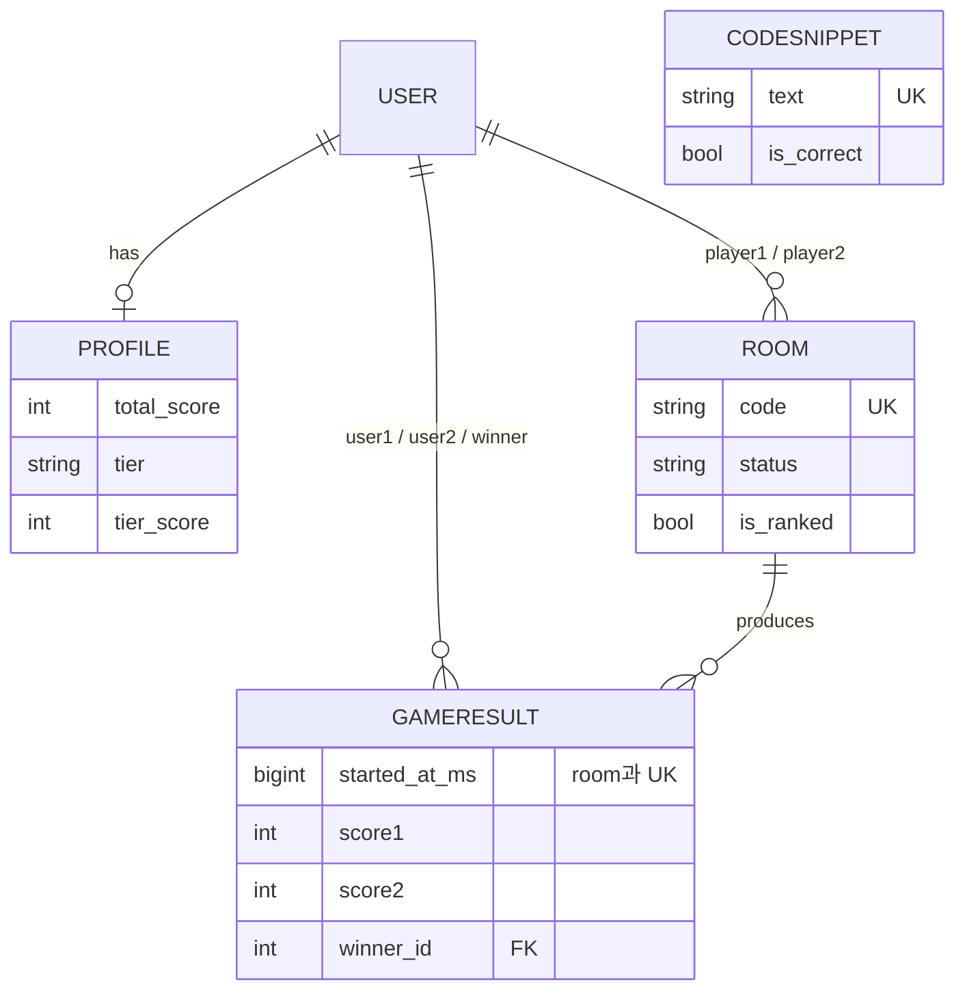

# 코드비 (CodeBee) 프로젝트 문서

# 1. 프로젝트 요약

화면에 떨어지는 코드 스니펫을 먼저 타이핑해 맞히는 **2인 실시간 대전 타이핑 게임**. 몰입캠프 공통과제, 4일(개발 3일 + 배포 1일) 진행.

| 항목 | 내용 |
|---|---|
| 인원 | 2인 팀 (박서윤, 김도현) |
| 장르 | 1:1 실시간 대전 타이핑 게임 |
| 핵심 과제 | 동시 제출 시 레이스 컨디션 방지, 실시간 화면 동기화 |
| 백엔드 | Django 4.2 + Channels 4.3 (ASGI/WebSocket) |
| 프론트엔드 | React 19 + TypeScript + Vite |
| 데이터 저장 | PostgreSQL(영속) + Redis(휘발성 상태·원자 연산) |
| 배포 | KCLOUD VM 1대, Cloudflare 프록시 |

---

# 2. 프로젝트 소개

- **주제**: 낙하하는 코드 스니펫 타이핑 대결
- **목적**: WebSocket 실시간 동기화와 동시성 제어(레이스 컨디션 방지)의 직접 설계·구현
- **핵심 문제 2가지**
  - 서로 다른 서버 프로세스에 연결된 두 유저의 화면 동기화
  - 동시 제출 시 정확히 한 명만 점수 획득 보장
- **설계 결정**: 전용 게임워커 프로세스 대안 대신 **Redis 원자 연산(Lua 스크립트)** 채택 — 근거는 4.5절
- **타깃 사용자**: 함께 즐기고 싶은 2인(친구, 스터디 메이트 등)

---

# 3. 게임 기능 및 튜토리얼

## 시작
- 회원가입: 아이디(영숫자 15자 이내), 비밀번호(0000~9999, 슬라이더 입력)
- 로그인 후 로비 진입

## 로비 구성
- 좌측: 게임 모드 3분할(랭킹전 / 친선전 / 연습모드)
- 우측: 전체 랭킹(리더보드)
- 헤더: 내 티어 배지, 설정(⚙️) 버튼

## 랭킹전
- 자동 매칭(대기시간 비례 매칭 범위 확장)
- 매칭 대기 화면에 상대 티어 표시
- 시작 전 3초 카운트다운(BGM 정지 + 카운트다운 효과음)
- 낙하 속도 친선전 대비 30% 감소(실수 비중 완화)
- 승패에 따른 티어 점수 증감, 승급 시 전용 연출
- 재대결 없음, 상대 이탈 시 자동 재매칭
- 결과는 친선전과 분리(짜고치기 방지 위해 친선전은 티어 미반영)

## 친선전
- 방 만들기 / 참가하기(코드 기반)
- 방장이 난이도 선택 후 시작, 재대결 가능

## 연습모드
- 로컬 시뮬레이션(서버 통신 없음), 결과 미저장
- 난이도별 봇 반응속도 차등(쉬움 5초 / 보통 4초 / 어려움 3초)

## 인게임 규칙
- 정답 코드 제출: 최대 1000점(길이 비례)
- 오답 코드 제출: -500점
- 화면에 없는 문자열 제출: 0점
- 동시 제출 시 선착순 판정
- 낙하 완료 코드 제출 불가
- 60초 종료, 상대 이탈 시 자동 승리, 자진 포기 가능

## 방해 아이템
- 경고(⚠️): 커스텀 모달, 닫을 때까지 입력 불가
- 꿀(🍯): 화면 일부 가림, 3초 지속, 중첩 가능

## 티어 시스템
- 7단계: 아이언~챌린저, 단계별 0~99점 승급제
- Elo 유사 방식으로 매칭 상대와의 격차 기반 증감폭 산정

## 리더보드
- 티어 점수 기준 정렬, 공동 순위 지원(스크롤 뷰)
- 상위/하위 랭킹 유저 중복 없음

## 사운드
- Web Audio API 합성 효과음(호버/클릭/타이핑/제출/정답/오답/오타)
- 로비 BGM(합성곡), 인게임 BGM(음원 파일)
- 설정 모달에서 BGM/효과음 볼륨 조절, 게임 규칙·로그아웃 포함

---

# 4. 시스템 아키텍처

## 4.1 기술 스택

| 영역 | 기술 |
|---|---|
| 백엔드 | Django 4.2, Channels 4.3(daphne, ASGI), channels_redis |
| 프론트엔드 | React 19, TypeScript, Vite, react-router-dom, zustand |
| DB | PostgreSQL(영속), Redis(휘발성 상태 + 채널 레이어) |
| 배포 | KCLOUD VM 1대(Postgres·Redis Docker, Django native+systemd), Cloudflare |

## 4.2 전체 구조

```
                     ┌────────────┐
                     │ PostgreSQL │  ← 영속 데이터
                     └─────┬──────┘
        ┌──────────────────┴──────────────────┐
 ┌──────────────┐                       ┌──────────────┐
 │  프로세스 1    │◄──────Redis──────────►│  프로세스 2    │
 │ (Channels     │  채널레이어 + 원자연산   │ (Channels     │
 │  ASGI worker) │  (SET NX, Lua Script)  │  ASGI worker) │
 └──────┬───────┘                       └──────┬───────┘
        │ WebSocket                             │ WebSocket
        ▼                                       ▼
     유저 A                                   유저 B
```

Redis가 유일한 진실 공급원 — 유저의 프로세스 배치와 무관하게 동작.

## 4.3 배포 구조

```
사용자 → Cloudflare(DNS/프록시) → KCLOUD VM
  ├── nginx(80/443 → 127.0.0.1:8000)
  ├── Channels 워커(daphne, systemd)
  ├── PostgreSQL(Docker)
  └── Redis(Docker)
```

- Django는 Docker 미사용, native + systemd 운영(재시작 속도, 반복 개발 편의)
- 개발: Vite가 `/api`, `/ws`를 Django(8000)로 프록시 / 배포: Django+WhiteNoise가 정적파일 직접 서빙

## 4.4 데이터 분리 원칙

| 구분 | 내용 | 저장 위치 |
|---|---|---|
| 정적 | 코드 스니펫 풀 | 프로세스 로컬 메모리(cache-aside) |
| 동적 | 낙하 코드, 선점 상태, 점수, 매칭 큐 | Redis(공유) |

## 4.5 동시성 제어 — Redis 원자 연산 채택 이유

| | 전용 게임워커 | Redis 원자 연산(채택) |
|---|---|---|
| 레이스 방지 | 코드 규율 의존 | Redis 엔진이 원자성 보장 |
| 지연시간 | 홉 4번 | 홉 2번 |
| SPOF | 추가 SPOF 발생 | 기존 의존성 재사용 |

**적용 사례**
- 제출 판정: 매칭+선점+채점+제거를 Lua 스크립트 하나로 원자 처리
- 스폰 선점: `spawn_lock:{room}:{tick}`(SET NX EX)으로 틱당 단일 프로세스 처리
- 매칭: 큐 조회+탐색+제거를 원자 처리, 매칭 후 통보는 별도 태스크로 분리(자기 통보로 인한 취소 레이스 방지)

## 4.6 실시간 동기화

- 방 단위 Channels Group + Redis 채널 레이어로 프로세스 간 브로드캐스트
- 낙하 애니메이션은 서버 타임스탬프(`spawn_ts`) 기준 클라이언트 독립 계산, 클럭 오프셋 보정

## 4.7 DB 스키마



- `total_score`: 역대 최고 한 판 점수(누적 아님)
- `tier`/`tier_score`: 랭킹전 결과만 반영
- `is_ranked`: 티어 반영 대상 구분
- `GameResult`: `(room, started_at_ms)` UK로 재대결 판 구분 + 중복 기록 방지

## 4.8 API 개요

| Method | Endpoint | 설명 |
|---|---|---|
| POST | `/api/signup/`, `/api/login/`, `/api/logout/` | 인증 |
| GET | `/api/me/`, `/api/me/tier/` | 로그인/티어 조회 |
| POST | `/api/rooms/`, `/api/rooms/<code>/join/` | 방 생성/참가 |
| GET | `/api/leaderboard/` | 전체 랭킹(티어 기준, 공동순위) |
| GET | `/api/practice/snippets/` | 연습모드 스니펫 |
| WS | `ws/room/<code>/` | 게임 진행(스폰/제출/판정/종료/재대결/포기) |
| WS | `ws/matchmaking/` | 랭크 매칭 큐 |

## 4.9 프론트엔드 구조

- `pages/`: Login, Signup, Lobby(로비/대기실/인게임/결산 통합)
- `components/`: GameScreen, MatchmakingModal, PracticeMode, Leaderboard, TierBadge/Icon, PromotionBanner, SettingsModal
- `lib/sound.ts`: Web Audio API 사운드 엔진(합성 효과음, BGM 전환, 볼륨 설정)
- 상태 관리: zustand(인증) + 페이지별 로컬 state/WebSocket 이벤트
